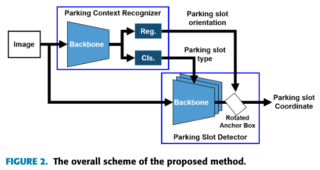
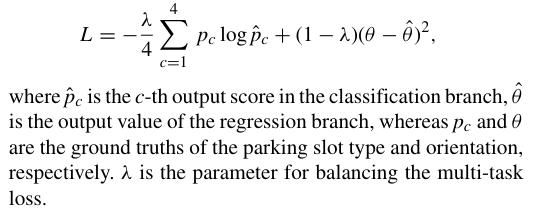
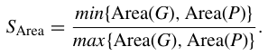
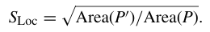

# 读Context-Based Parking Slot DetectionWith a Realistic Dataset  
---  
[paper](https://ieeexplore.ieee.org/stamp/stamp.jsp?tp=&arnumber=9199853)  
[github](https://github.com/dohoseok/context-based-parking-slot-detect/)  
[贡献](##贡献) | [模型框架](##模型框架) | [具体实现](##具体实现) | [其他需要注意](##其他需要注意) | [todo](##todo)

---  

1. ## 贡献
- 提出一种基于上下文的两阶段停车位检测方法；  
- 在yolo的基础上，由旋转物体检测器根据旋转角度用旋转锚框框出停车位；  
- 新的停车位数据集，新的评估指标；  

2. ## 模型框架  

两个部分，上下文识别器(PCR)和停车位检测器(PSD)；  
上下文识别器：骨架为MobileNetV2，从图片提取车位类型和旋转角度；停车位识别器：骨架为YOLOv3,从图片和类型角度得出最终旋转过的锚框，圈出车位；  

3. ## 具体实现
- PCR: 输入图像经MobileNetV2，从回归分支得锚框旋转角度，从分类分支得车位种类；输入图像被分为四类之一：平行、垂直、对角线、或非停车空间；由停车位分隔线得估计角度；每张图片只会被分为其中一类，因为相邻停车位有相同方向和类型。
- PSD: 上述三类图各对应一个检测器，分别估计停车位的四个顶点的坐标，其中检测的锚框会旋转 PCR 估计的角度。  
- 损失函数  
      包含分类损失和回归损失；  
    旋转非极大抑制(rotated non-maximum suppression)，[不太明白啊](##todo)
- 数据集
    包含图片，类型，方向角度值及顶点坐标；  
    按照场景分类，训练更高效；  
    相比ps2.0，不同亮度情况多，不同大小车位多，包含更多种类的样本ps2.0中所不包含的；  
- 评价指标  
    并不使用IoU作为评价指标（即使不同情况也有相同IoU），提出新评价指标停车分数S=SArea*SLoc（面积的估计精度和位置估计精度）。其中G为真值，P为预测值，P‘为G与P的交集。  
      趋近于1，表示预测面积和真实面积趋同；  
     趋近于1，表示预测的都在真实的里面；  
    相比IoU，S能够适配不同的车辆尺寸和停车位尺寸，更适用于工程算法开发。

4. ## 其他需要注意  
    传统方法  
    - 基于线的方法：找两条间隔开的分隔线；  
    - 基于角点的方法：先检测入口线与分割线相交角点，再结合角点坐标检测停车位；  

5. ## todo  
    [nms](https://www.cnblogs.com/makefile/p/nms.html)