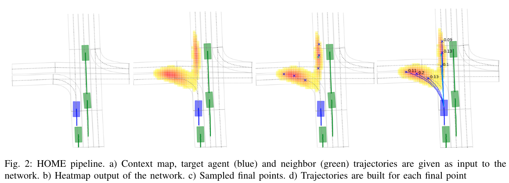

# 读HOME: Heatmap Output for future Motion Estimation  
[paper](https://paperswithcode.com/paper/home-heatmap-output-for-future-motion)  

[贡献](#贡献) | [模型框架](#模型框架) | [具体实现](#具体实现) |

## 贡献
1. 提出一种用图像输出解决运动预测问题的方法；  
2. 方法将经典CNN与注意力结合用于智能体与环境特征提取及交互；并且能够调整MR与FDE之间的看重程度而不用重新训练整个网络；  
3. 在Argoerse轨迹预测排行榜上第一；  

## 模型框架
整个模型分为三部分，概率热力图生成，预测终点采样，轨迹生成；  
轨迹预测流程：  
概率热力图生成：可能去到的地方；     
预测终点采样，MR与FDE采样算法：从范围中采样，减少MR和FDE；   
最终轨迹全连接网络生成，从当前位置到采样点回归出轨迹；  

## 具体实现  
- 概率热力图生成：   
以预测物体为中心，5个语义通道：可行驶区域、车道边界、有方向的连接中心线(HSV的3通道)的栅格图通过CNN与MaxPooling下采样的特征图；   
（x,y,time_stamp,has_value)四元数通过UGRU进行编码，目标智能体与其他智能体不共享权重；  智能体间交互通过注意力机制完成；最后与环境特征向量拼在一起；  
通过TransposeConvolutions来上采样增大特征图尺寸，扩大输出表示的范围；  
输出的热力图目标是真实轨迹点为中心的高斯分布，像素级的损失函数；  
- 预测终点采样：  
采样的目的是使做出的选择（即预测轨迹的最终点是有更好的表现（小FDE/MR））；  
在预测模式与真实轨迹间优化MR，通过最大化采样点两米圈内概率的积分，实现MR最小化；  
优化FED，即在图中找到k个使下式成立的点；  
采样方法：    
通过一个系数平衡MR与FDE对看重程度。  
- 轨迹生成：  
通过另外的一个模型来生成轨迹，全连接层，输入为连接了目标位置的历史轨迹，输出未来时间段内的位置坐标；概率由热力图中两米圈的积分得；

