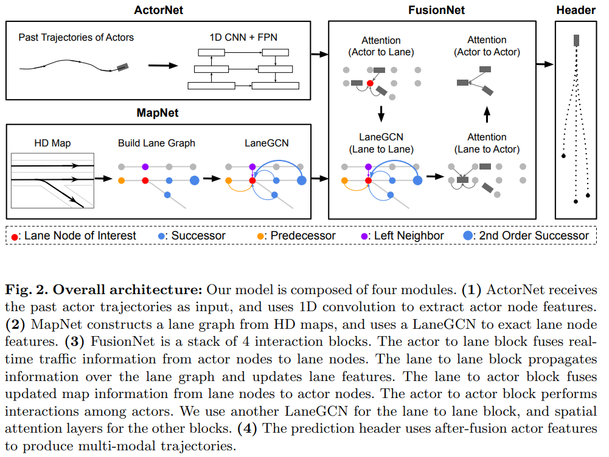
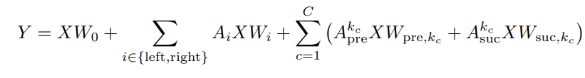
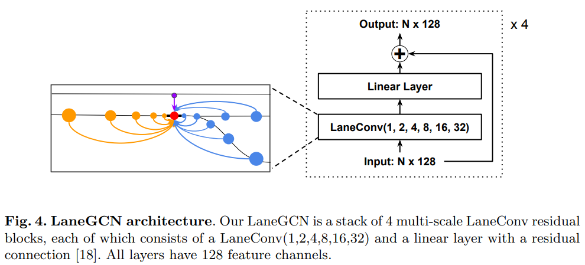
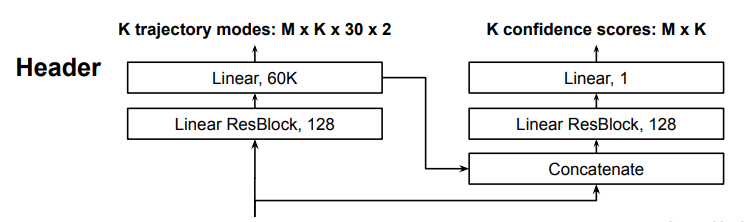
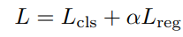
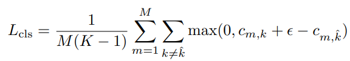
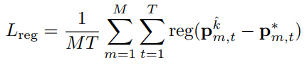

## LaneGCN  
[paper](https://arxiv.org/pdf/2007.13732.pdf)  
[github](https://github.com/uber-research/LaneGCN)  

1. 贡献  
    1. 使用图的模式来表达地图矢量数据，而非栅格化图片；  
    2. 从图卷积，提出LaneGCN，设计了整个网络；
    3. SOTA；  
2. 模型框架  
     
   三部分：特征提取（1DCNN+FPN提取车辆轨迹信息；LaneGCN提取地图特征），特征融合（注意力和LaneGCN），轨迹预测（分类概率和回归轨迹）；  
3. 具体实现
   - 信息提取  
       - 道路图  
       根据车道中心线的矢量数据及连接关系构建车道图，并利用膨胀的车道图卷积（参考图卷积方式）对地图特征进行提取。  
       车道图构建：  
       将中心线的点连成的线段看作节点。节点间有四种关系{前驱，后继，左邻，右邻}，对应四种邻接矩阵。节点有形状特征（长度）和位置特征，并通过MLP进行编码。  
       图卷积操作：  
          
       三个部分：节点本身特征，MLP编码；左右邻，图卷积方式进行编码；前驱后继，由膨胀的图卷积方式进行编码。膨胀即将前后C个节点，均进行图卷积然后求和，以此便实现了更大的感受野。此外，整个的图卷积模块还有一个残差连接。  
         
       - 车辆历史轨迹特征提取  
       提出CNNs和RNNs都能够用于时序数据特征提取。此处使用1D CNN进行特征提取，外加一个特征金字塔提却不同维度特征，最后用残差进行不同维度特征融合。  

   - 特征融合及预测  
       之前的研究多是actor与actor之间的关系，少关注actor与map或map与actor之间关系；  
       - 交互网络  
       A2L->L2L->L2A->A2A: 除L2L是与MapNet一样，均为LaneGCN；其他三部分都是Attention机制，在A2L中，引入实时交通信息，如红绿灯信息，车道是否可用等。  
       - 分支预测  
         
       两支：回归预测轨迹，分类预测概率。  
       回归：融合的结果直接用于轨迹预测；  
       分类：结合回归结果和融合结果，得出每条轨迹的概率；  
       **思考**：如何在此处实现意图指导轨迹预测？意图能否视为是预测的概率，用概率来指导实际的轨迹生成？  
       - 损失函数   
       对应预测两个分支：回归损失和分类损失。  
         
       分类损失：对于每个acotr的每条轨迹（除开有minFDE的那条），将预测分数与minFDE那条做比。总是希望minFDE的那条是最大的分数，这样做比结果为负数，max取值为0，没有损失，这是最好的，然而，当其他轨迹分数大过minFDE，那么做比结果为正，有损失，需要优化；其中，ε有增强损失的作用，当做比结构-0，我认为还不够好，这样minDFDE与其他的区别不够明显，-0+ε为正数，还需要优化。这就是 `max-margin loss` 。  
         
       回归损失：对于minFDE的那条轨迹，每个点都和GT做比，我希望minFDE能够无限接近真实轨迹。  
         
4. 其他需要注意  
    - 栅格化地图缺点  
    1. 信息损失  
    2. 地图特征难以高效提取  

**~~周末赶作业实在是太赶了，实在是不可~~**
**~~看得匆忙~~**
   

