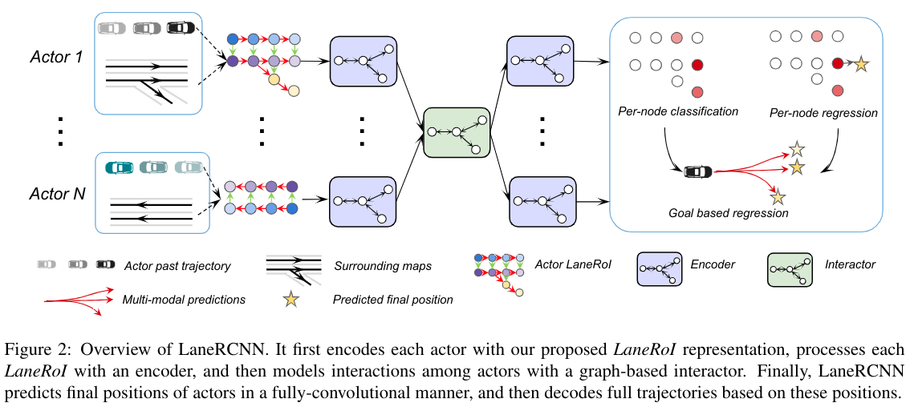

# LaneRCNN
[paper](https://www.researchgate.net/publication/348589217_LaneRCNN_Distributed_Representations_for_Graph-Centric_Motion_Forecasting)  

[贡献](#贡献) | [模型框架](#模型框架) | [具体实现](#具体实现) | [其他需要注意](#其他需要注意)   

## 贡献  
- LaneRoI：针对于特定智能体的图，其中包括该智能体历史轨迹与周围地图拓扑结构；  
- LaneRCNN：通过编码上下文，建模智能体间交互，利用地图拓扑结构来预测未来轨迹的图中心轨迹预测模型；  
- 1st rank;  

## 模型框架  
  
获得每个actor的LaneRoI，对其中信息进行特征编码，然后嵌入全局车道图中，进行actor之间的交互，最后根据每个actor的LaneRoI，在车道中心的基础上进行轨迹预测。   

## 具体实现  
LaneRoI：首先获取每个actor在将来T内可到达的所有车道及过去L内的历史轨迹；车道构成车道图。  
LaneRoI中车道图中的每个节点对于一段道路，还有一个嵌入来表示其几何（中心，起点坐标及弧度）与语义（是否转弯，红绿灯等）信息，还包含过去的历史轨迹信息
LaneRCNN中算子  
- 卷积：同LaneGCN
- 池化：在相关的节点中，对其相对位置（包含相对位置和起点）通过MLP来学习池化操作进行特征提取。  

LaneRoI编码：给定scene，对每个RoI进行4层车道卷积，每次卷积会将本节点信息与关联节点传播；为解决长时依赖，引入跳连。   
LaneRCNN：  
先聚合：将编码后的特征投影到全局车道图对应节点中，对于全局车道图中每个节点，使用池化操作构造其嵌入；再分散：再对全局图中每个节点及其附近节点做池化，将结果跳连到对应LaneRoI的特征中  
基于LaneRoI特征做预测，输出5个值，包括与最终目标最近的车道段的概率、与最终目标最近的车道段的差值（deltaX，deltaY，delta角度的sin和cos），利用恒加速度模型拟合出一条预测起点与终点间的曲线，按时间点对曲线采样获得轨迹点。  
损失函数：分类损失、回归损失、真实轨迹与预测轨迹间的拟合损失   
- 分类损失是online hard example mining，交叉熵  
- 回归损失是只计算正例，如与真实轨迹终点最近的车道段，smooth—L1  
- 拟合损失是将真实轨迹投影到预测轨迹中，按照Frenet坐标系计算smooth—L1  

## 其他需要注意  
可以利用LaneRoI中车道中心线作轨迹预测的anchor，以提供良好的先验。
