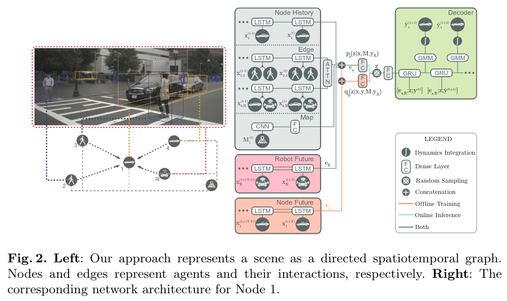

# 读 Trajectron++: Dynamically-Feasible TrajectoryForecasting With Heterogeneous Data
[paper]()  
[github](https://github.com/StanfordASL/Trajectron-plus-plus)  
[贡献](##贡献)
[模型框架](##模型框架)
[具体实现](##具体实现)
[其他需要注意](##其他需要注意)

1. ## 贡献  
   1. 异构数据如何融合；  
   2. 提出一种考虑动力学约束基于学习的多智能体轨迹预测方法；
2. ## 模型框架  
      
    特征提取包括对智能体本身历史轨迹、智能体与智能体之间的关系以及环境信息的提取；此外在训练阶段，还用到了主车规划的未来轨迹用于训练；
    生成潜在变量z；
    GRU解码得到轨迹；
    

3. ## 具体实现  
   1. 图构建：  
        - 图节点：每一个智能体都是一个节点；智能体种类不同，节点种类不同，大致分车和人；每个节点的历史轨迹作为其特征；  
        - 图边： 节点与节点间的交互构成边；有方向，用于表示节点间不对称的影响；影响程度由l2距离来表示；

   2. 网络构成：  
       1. 智能体历史特征提取： LSTM对历史轨迹处理；
       2. 智能体之间的交互： 在同类型边中，特征累加求和解决不同场景不同智能体数量的问题；聚合的特征由LSTM进行编码；每一种类型的边均有对应的LSTM特征提取网络；不同类型的边之间，通过注意力实现整个场景中，智能体之间的交互；  
       3. 地图特征提取： 这也是体现异构数据融合的地方；将栅格化地图CNN卷积后，经FCN提取成地图特征；该种方式不止可用于栅格化图片，甚至是点云、摄像头图像、行人骨架数据等数据均可用这种方式提取；  
       4. 规划轨迹： 主车的规划轨迹利用LSTM编码参与训练；  
       5. 特征融合： 上述特征直接拼接在一起，经过FCN的压缩，获得潜在变量z，其直接对应着目标分布；
       6. 轨迹预测：由潜在变量z经过GRU解码出二维高斯分布的参数，经动力学模型获得预测的轨迹；

4. ## 其他需要注意  
    - 没整明白回归的方法和这种生成的方法到底啥不一样阿，不都是提取特征，融合，解码？差在融合这一步？
    - 没有损失函数，生成的方法不用损失函数？

