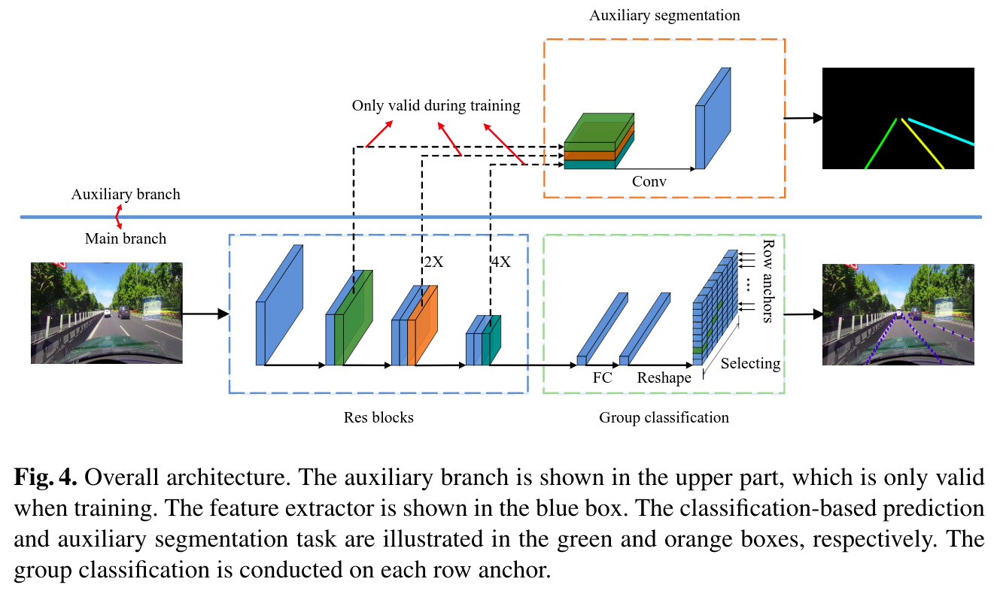

# Ultra Fast Lane Detection  

[paper](https://arxiv.org/abs/2004.11757v4)  
[github](https://github.com/cfzd/Ultra-Fast-Lane-Detection)  
 

1. 贡献  
   1. 提出一种简单有效的车道检测方法，快且解决了在图上无车道时推测车道的问题；
   - 快：将语义分割问题转化成分类问题（减少运算）,Row Anchor， 300+FPS；  
   - 解决图上无车道时车道推测：结合全局的特征预测车道，相比语义方法有更大的感受野；
   1. 基于上述的方法提出一个结构化损失函数；
   2. SOTA； 
 
2. 模型框架（看着框架说实现）  
	  
	上下两个分支：  
	主下，先ResNet特征提取，再按rowanchor分类；  
	次上，语义分割，仅在训练时有效；    

3. 具体实现  
   1. 快：  
   首先将图像网格化，每一行网格有若干个rowanchor；然后根据提取的全局特征，判断rowanchor是否是车道线。相比于语义分割，逐个像素来算，基于提前定义好的rowanchor大大减少了运算量，故快。
     

   2. no-visual-clue problem:  
   利用来自其他地方的信息来解决这一问题：拥有整个图像的感受野；通过其他车道线（损失函数）或者车道形状或者车的方向来推测；通过rowanchor的方式将像素级和更大范围的车道线特征联系起来；  

   3. 损失函数  
   三个部分：分类损失、结构损失、分割损失；  
     
   分割损失：每行预测的rowanchor与真实位置one-hot向量的交叉熵之和；有一个额外的维度来表示车道缺失，故每行是w+1，而不是w；  
     
   结构损失：两个部分，车道线的连续性约束Lsim与车道线的形状约束Lshp； 连续性约束Lsim，车道总是连续的，相邻的行的rowanchor应该相互靠近，故取相邻行预测量的一范数；形状约束Lshp，由于透视效果，车道线看上去是直的，至少在近处总是这样，故通过相邻三行的二阶差分来限制（用二阶不用一阶的原因）；  
     
   
     
   分割损失：利用多尺度特征进行语义分割出车道线条的交叉商（只在训练时有这个辅助分支，测试时去除，不影响速度）；  

4. 文章其他需要关注的点
   1. 传统方法  
   - HSL colot model[25] and edge extraction algorithms[29,27]
   - Tracking[13,28]
   - Markov and conditional random fields[16]
   - Template matching and vector machines[15,6,20]
   1. 深度学习方法  
   - semantic segmentation: VPGNet[17], SCNN[22], SAD[9]  
   - Sequential prediction: LSTM[18], Fast-Draw[24]  
   - Clustering: [10,30]
   - 3D formulation: [4]  
