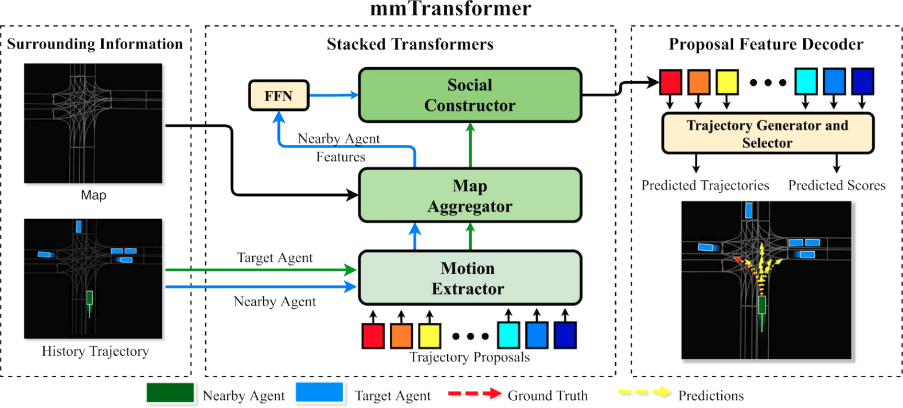
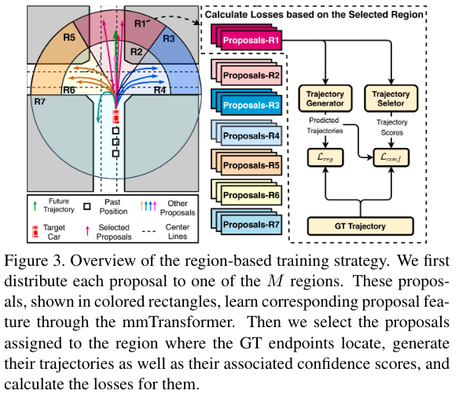
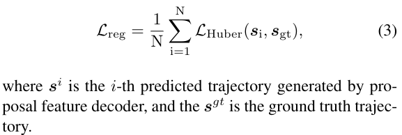
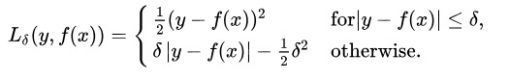
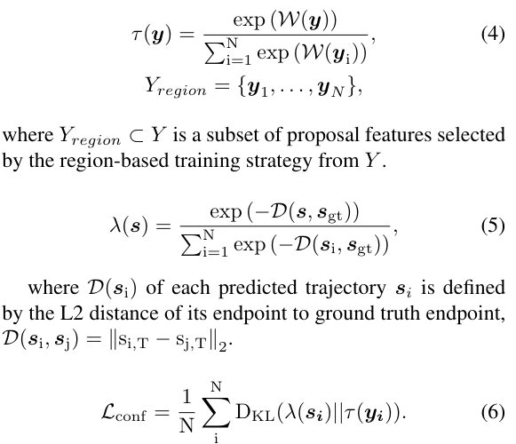
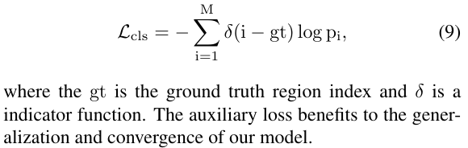
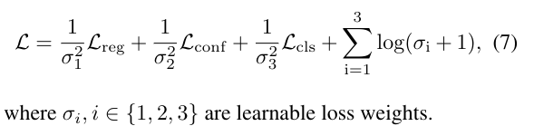

# 读Multimodal Motion Prediction with Stacked Transformers
[paper](https://arxiv.org/pdf/2103.11624.pdf) | [github(尚未更新代码)](https://github.com/decisionforce/mmTransformer)  
[贡献](##贡献) | [模型框架](##模型框架) | [具体实现](##具体实现) | [其他需要注意](##其他需要注意)   

## 贡献
- 第一个使用堆叠Transformer
- RTS  
- STOA

## 模型框架
  
中间的三块主干即堆叠的Transformer，分别用于提取轨迹地图及交互信息；最后也是回归轨迹和分数。采用新的基于区域的训练策略来训练网络。

## 具体实现
- 轨迹特征提取  
从目标车辆和临近车辆的轨迹中，提取特征。由编码器和解码器组成。
- 地图特征提取  
接受轨迹特征和地图数据（车道中心线的向量表示），输出经地图特征加权后的目标车辆轨迹特征和临近车辆轨迹特征；  
- 交互特征提取  
在目标车辆轨迹特征与临近车辆轨迹特征作输入，但只解码目标车辆特征以提高效率；
- 轨迹解码  
类似于LaneGCN，两支：轨迹和分数；  
- Region-based Training Strategy  
[35]告诉我们，直接回归预测轨迹，将导致模式平均问题，不能体现多模；只使用minFDE的预测轨迹来计算回归和分类损失能解决这一问题；
多模K越多，会导致模式崩溃问题；
RTS即将预测轨迹归类到按照真实轨迹终点聚类而成的几个空间区域中，通过模型训练优化改善每个区域中的预测表现；
区域划分：将车辆旋转到航向指向y轴正方向，按照终点来聚类，得到7个区域；
计算归于真实轨迹所在区域的每条预测轨迹的分类回归损失，而不是最靠近的真实轨迹的那一条轨迹的损失；
  
- Loss Function  
用于回归损失的Huber损失、用于评分的KL散度、区域分类损失、；  
回归损失
  
[Huber损失](https://blog.csdn.net/u013841196/article/details/89923475)： 相比平方误差损失，Huber损失对于数据中异常值的敏感性要差一些。在值为0时，它也是可微分的。它基本上是绝对值，在误差很小时会变为平方值。误差使其平方值的大小如何取决于一个超参数δ，该参数可以调整。当δ~ 0时，Huber损失会趋向于MSE；当δ~ ∞（很大的数字），Huber损失会趋向于MAE。  
KL散度  
  
[KL散度](https://blog.csdn.net/qq_40406773/article/details/80630280): 在概率论或信息论中，KL散度( Kullback–Leibler divergence)，又称相对熵（relative entropy)，是描述两个概率分布P和Q差异的一种方法。  
区域分类损失  
鼓励到预测在正确的区域的轨迹有更高的分数，交叉伤损失函数；  
  
中间层损失  
加速训练过程
整个损失函数  
  

## 其他需要注意
生成预测轨迹的两种方法：
- 基于概率生成模型：
- 基于预定义轨迹的方法：  
- 回归轨迹

两种改善模式平均的机制：  
- 轨迹提议机制
- 基于区域的训练策略

